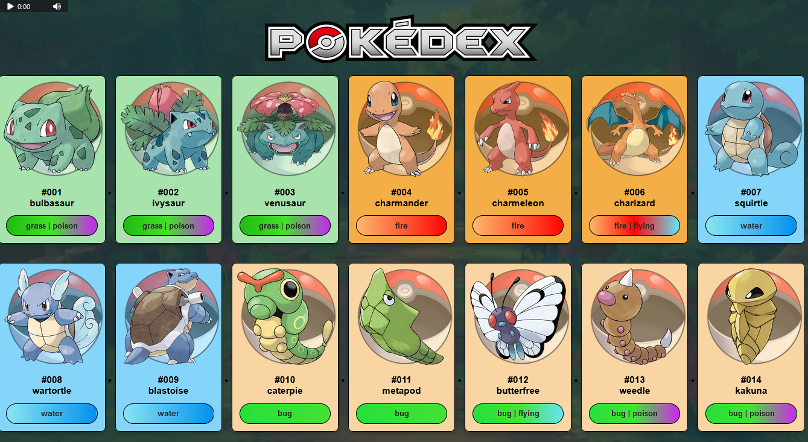
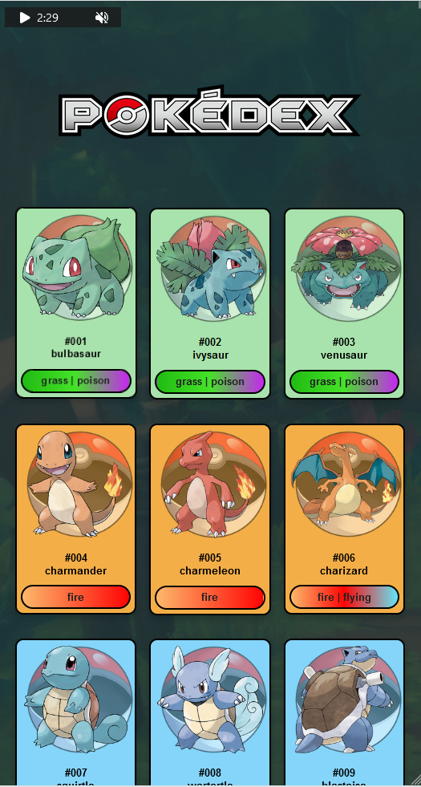
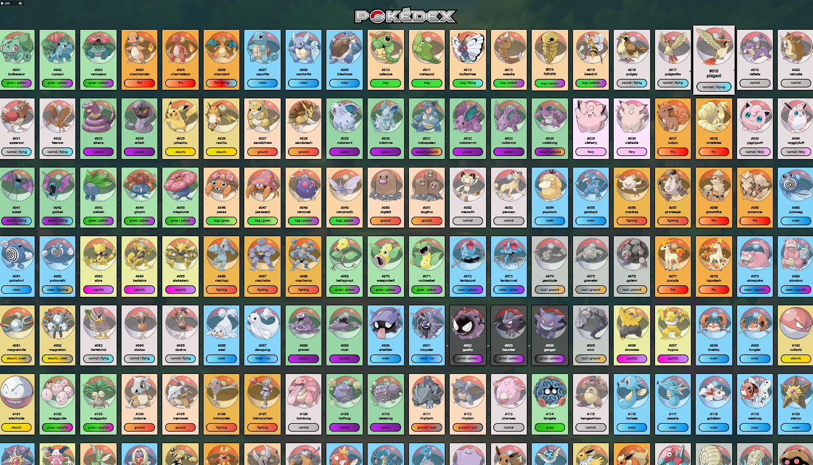

# Projeto API PokéDex

## Descrição do Projeto

A Pokédex é uma aplicação web simples que exibe informções sobre pokémon em cartões interativos.
Cada cartão representa um Pokémon diferente e contém seu número da Pokédex, nome, tipo e uma imagem.

## Linguagens e Ferramentas

    - HTML
    - CSS
    - Javascript
    - Vscode
    - Live Server

## Como Executar o Projeto

Para executar o projeto da Pokédex, siga as etapas:

1. **Clonar o repositório**: Faça o clone do repositório para o seu computador usando o seguinte comando GIT:

    - git clone https://github.com/raonircl/pokedex.git

2. **Navegue até o diretório**: Entre na pasta do projeto:

    - cd pokedex

3. **Abra o arquivo HTML**: Abra o arquivo "index.html" em um navegador da web. Você pode fazer isso clicando com o botão direito no arquivo e selecionando "Abrir com" e, em seguida, escolhendo um navegador.

4. **Interaja com a PokéDex**: Após abrir o arquivo HTML, você verá a PokéDex em ação! Os cartões de Pokémon serão exibidos na tela. Você pode clicar em cada cartão para obter mais informações sobre o Pokémon.

## Capturas de Tela

Aqui estão algumas capturas de tela do projeto "PokéDex" em ação:

## Tela Inicial - Desktop

## Tela Incial - Mobile

## Detalhes

## Notas Adicionais

- A PokéDex é responsiva e se adapta a diferentes tamanhos de tela, garantindo que os cartões permaneçam organizados e legíveis em dispositivos móveis e desktops.

- A aplicação busca informações sobre os Pokémons de uma fonte externa usando a PokeAPI (pokeapi.co).

Espero que este README tenha ajudado a entender o projeto e como executá-lo. Divirta-se explorando a PokéDex e descobrindo informações sobre seus Pokémon favoritos!